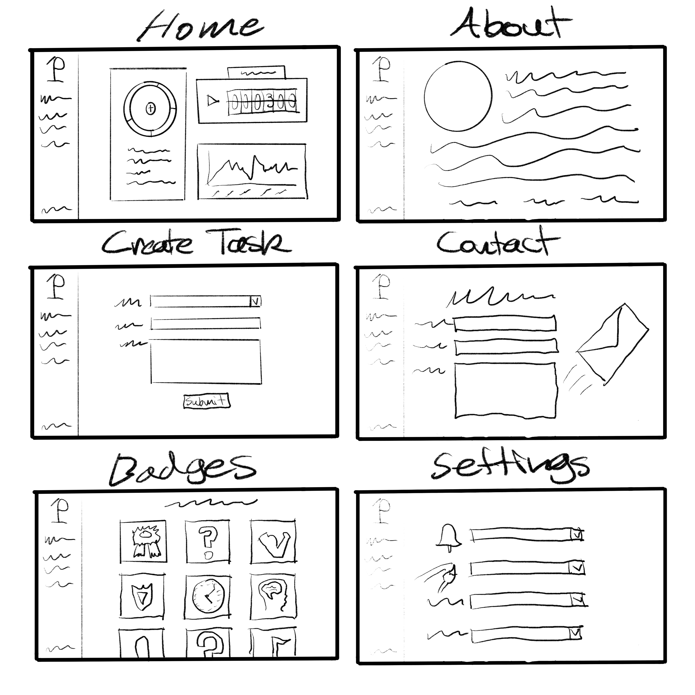
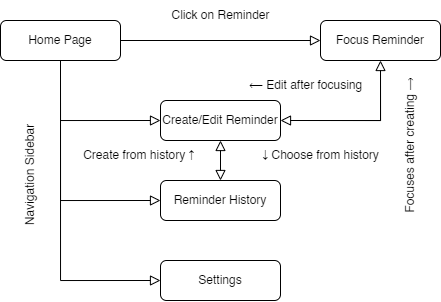

# Definition Statement

I want to build an application that...
- Application Goal: Decrease lack of family interaction and help organize/maintain a home & family relations.
- End User Incorporation: I will have my boyfriend and his siblings be the family to take care of the cats/dogs,
check/update the fridge contents, and add any other misc tasks
- End User Incorporation Start Date: Once basic JavaScript functionality is implemented
- End User Incorporation Importance: Get a better understanding of what feels/looks best in the application and
check for bugs
- Feedback Technique: Messaging via 3rd-party applications or through virtual meetings

# Audience

Who is using my application
- Family
- Family friends
- Close household neighbors

# Content Outline

What will be on each page
- Navigation Sidebar

What is the functionality of each page
- Home: Display reminders
- Reminder Focus: Displays in-depth content for a reminder
- Create Reminder: Allows users to fill out a form to create a reminder
- Reminder History: Allows user to view previous reminders to quickly create a reminder from a previous one
- Settings: Allow users to change application settings such as theme, notifications, etc.

What is purpose of my application
- Organize/maintain household tasks

What business or real world problem am I going to be solving
- The real world problem is that of a household struggling to maintain all the daily routines

### Website attributes

- Slogan: "Helping Home Feel Like Home"

- Color palette:
  - Charcoal (Dark Mode): 2C4251
  - White (Light Mode): FFFFFF
  - Jonquil: ECC30B
  - Coral: F37748
  - Indian Red: D56062

- Images

- Fonts

- Logos

- Navigation
  - Home
  - Create Reminder
  - Reminder History
  - Settings

# Mural User Story Map

[Mural Link](https://app.mural.co/t/ethansworkspace5487/m/ethansworkspace5487/1699581802132/35e0d040158d187188f1efaac881e06ddb1c0608?sender=uedd1fd021bb385ed7acd3663)

# Research

### List of applications researched

- What do you like about each site
  - _Cozi_: Has a recipe page that family members can choose from a wide variety of dishes
  - _FamilyWall_: The homepage displays a "wall" of cards for a plethora of options such as budgets,
  photo galleries, and even location tracking for everyone.
  - _Pixie_: Allows users to create "boards" so family members can view important information about
  specific family issues such as home maitenance, car needs, etc. while giving suggestions for what
  might need to be done

- What do you NOT like about each site
  - _Cozi_: The interface is bland and doesn't have a lot of options for what tasks need to be done
  - _FamilyWall_: It does not display any time-sensitive information on the homepage
  - _Pixie_: Adding/editing content is not very intuitive

- How will your application be different
  - My application will display time-sensitive tasks on the homepage and will have a much more
  intuitive UI with better styling.

# Wireframes

# User Flow Diagram

# SWOT Analysis

[SWOT](https://docs.google.com/document/d/1Bwn2wByb4IeT004Azn57w4JAHqj09UH9zmY0F4geerE/edit?usp=sharing)
