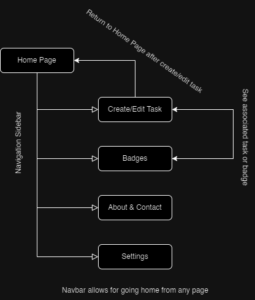

# Definition Statement

I want to build an application that...
- Application Goal: Vastly improves someone's motivation, health, and productivity for their everyday life
- End User Incorporation: I will have my boyfriend, his siblings, and myself be the main users to see if it improves our daily productivity
- End User Incorporation Start Date: Once basic JavaScript functionality is implemented
- End User Incorporation Importance: Get a better understanding of what feels/looks best in the application and
check for bugs
- Feedback Technique: Messaging via 3rd-party applications or through virtual meetings

# Audience

Who is using my application
- Students
- Health Trackers
- Athletes
- Workers
- Goal Oriented People
- Anyone

# Content Outline

What will be on each page
- Navigation Sidebar

What is the functionality of each page
- Home: Display reminders
- Create Task: Allows users to fill out a form to create a task and adding goals
- Badges: Allows user to view their accomplishments for completing goals
- About: Shows user app & developer bio
- Contact: Contact info for portfolios and bug submission
- Settings: Allow users to change application settings such as theme, notifications, etc.

What is purpose of my application
- Increase personal productivity

What business or real world problem am I going to be solving
- The real world problem is that of a person struggling to improve themselves

### Website attributes

- Slogan: "Prioritizing 1 Task at a Time"

- Color palette:
  - Black (Dark Mode): #000
  - White (Light Mode): #FFFFFF
  - Viridian: #3F7859
  - Berkely Blue: #1F385C
  - Red (NCS): #BF0D34

- Images

- Fonts

- Logos

- Navigation
  - Home
  - Create Task
  - Badges
  - About
  - Contact
  - Settings

# Mural User Story Map

[Mural Link](https://app.mural.co/t/ethansworkspace5487/m/ethansworkspace5487/1699581802132/35e0d040158d187188f1efaac881e06ddb1c0608?sender=uedd1fd021bb385ed7acd3663)

# Research

### List of applications researched

- What do you like about each site
  - _Pomofocus_: The app is intuitive, nice looking, contains a report section showing graphs of user progress, and has a lot of customization
  - _Super-Productivity_: Has the ability to add Projects for switching between different focus profiles on certain days (study Tuesday, work Thursday, YouTube Saturday)
  - _Health by Apple_: Allows the tracking of different health aspects and returns data in that form

- What do you NOT like about each site
  - _Pomofocus_: Simply lacks some of my vision for displaying information to users and is a pomodoro focused productivity application
  - _Super-Productivity_: Not super intuitive, and when explaining features in the app it is filled with long paragraphs of instructions
  - _Health by Apple_: Adding/editing content is not very intuitive and it does not automatically update graphs from a bundle of data you put in unless using a device like an Apple Watch

- How will your application be different
  - My application will display a few graphs at once with a fair amount of information and allow for a seamless adding/editing/deletion and progression of tasks

# Wireframes

# User Flow Diagram

# SWOT Analysis

[SWOT](https://docs.google.com/document/d/1Bwn2wByb4IeT004Azn57w4JAHqj09UH9zmY0F4geerE/edit?usp=sharing)
